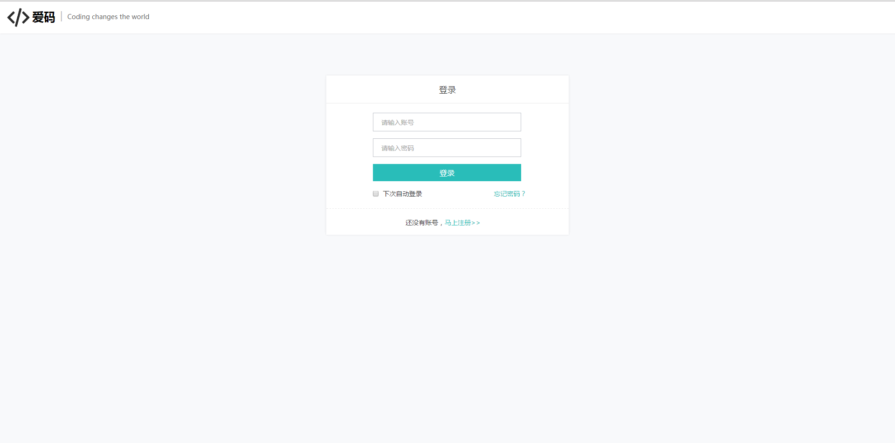
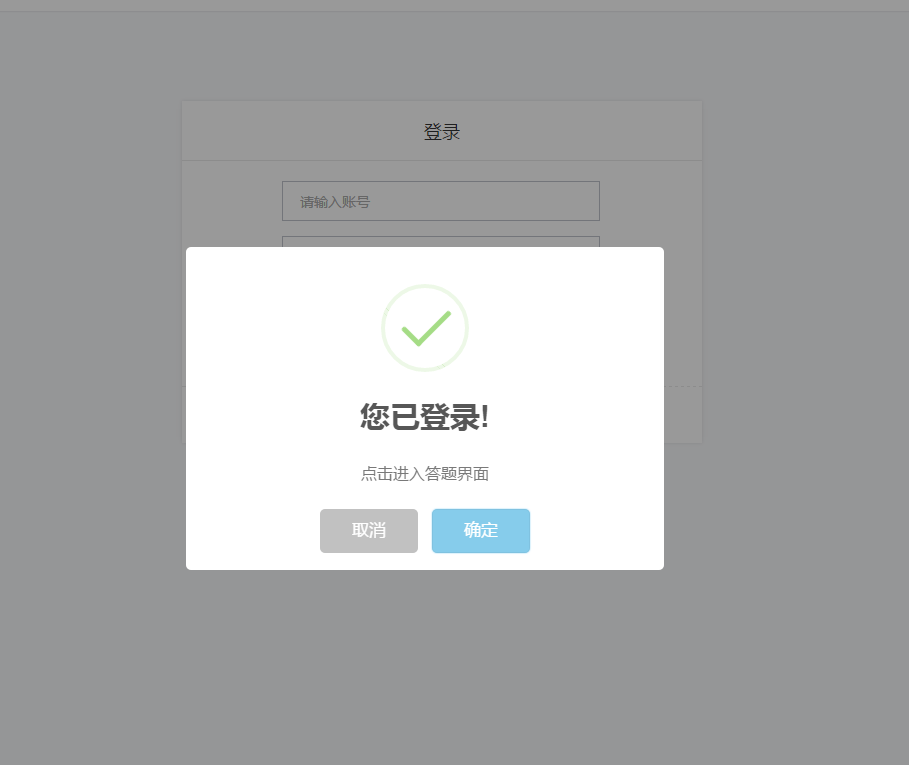
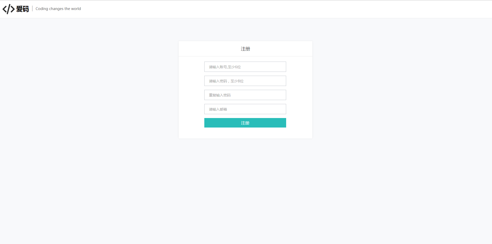
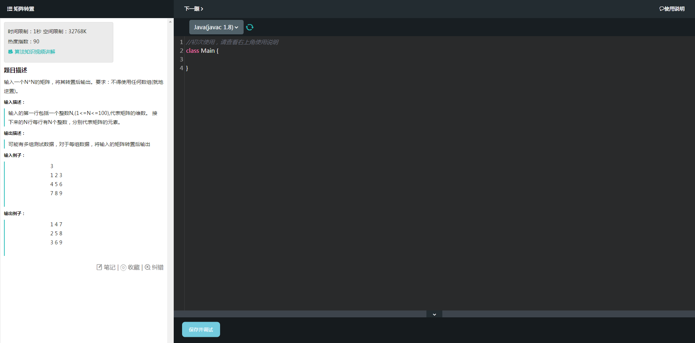

# 基于web的编程题自动阅卷系统

# program-system

> A Automatic scoring system for programming problems by web(js and javaweb)

## 使用方法

```javascript
git clone 到本地，搭建所需的java环境（Tomcat，mysql，jdk1.8）。
```

### 主要界面截图
#### 用户登录界面

#### 登录使用cookie记录用户登录的状态

#### 用户注册界面

#### 考试界面

#### 管理员登录界面

## 正在开发中的部分
* 后台管理系统
* 对考试进行计时和视频监控
## 感激
感谢我的毕设指导老师孙艺珍老师的指导，同时也感谢我的舍友唐洋对我Java方面的解惑（他的Java我觉得还不错）。
## 特别注明
由于本人没有找现成的模板，所以样式是照着牛客和赛码写的，代码完全不一样。
## 有问题反馈
在使用中有任何问题，欢迎反馈给我，可以用以下联系方式跟我交流
